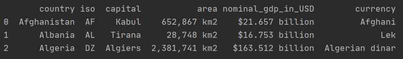

# Table of Contents
1. [Wikipedia scraping project](#wikipedia-scraping-project)
2. [Using this repository](#using-this-repository)
3. [Installation and configuration](#installation-and-configuration)


# Wikipedia scraping project

This project is aim to use the library BeautifulSoup on the website [Wikipedia](https://www.wikipedia.org/) in order to 
access the list of sovereign states and enter into each state to obtain information over the country.

Unlike the previous project, Wikipedia website is scraping friendly. This will allow us to use the same code to extract
the same information from many countries. 

Due to the list of countries is extensive the amount of request in the process takes around 140-150 seconds. If you want 
to apply this function for the first ```n``` countries instead, you'll need to introduce the number of countries you want 
inside the function ```wikipedia_country_data()``` located at the end of the script.

The script will:
* Create the dataframe
* Access wikipedia list of sovereign states
* Create the wikipedia url for every country
* Extract the html code of every country and save it in a list
* Iterate this list, extract and populate the dataframe with the country name, capital, ISO code, currency, area and nominal gdp.
* Return the dataframe




## Using this repository

To Run this repository locally:

* Clone the repository
    
* Run the following script
  ```shell script
  python wikipedia_countries.py
  ```


## Installation and configuration
To run the script locally you will need to have installed:
* Python v.3.x.x
* Libraries
    * pandas:1.1.3
    * request:2.24.0
    * beautifulsoup4:4.9.3
    * re:2.2.1